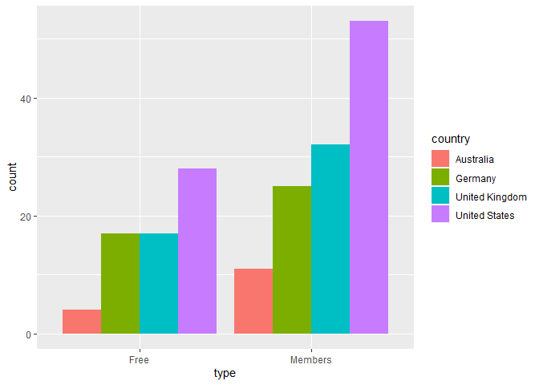
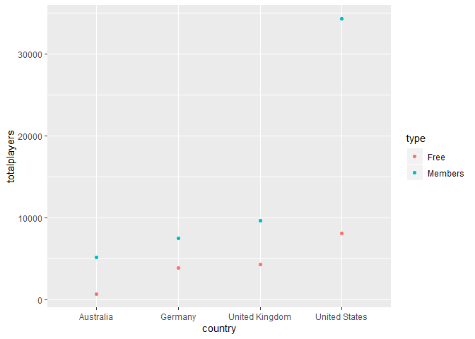
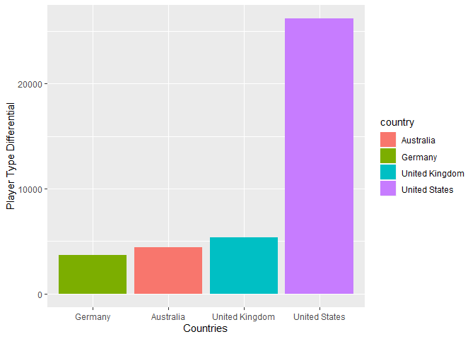

Web Scraping and Data Cleaning
================

## Project

This project uses the rvest package to retrieve the data stored in an
HTML table at, <https://oldschool.runescape.com/slu>. This webpage
contains data about the game’s servers and the number of players on
them. This data will be cleaned and used in some quick visualizations.

## Web Scrape

The rvest package is used to retreive the data stored in an HTML table.

``` r
rsweb <- read_html("https://oldschool.runescape.com/slu")

rswebdata <- html_nodes(rsweb,'.server-list__row-cell')
rsdata <- html_text(rswebdata)
rsdata <- gsub("\n"," ",rsdata)
head(rsdata)
```

    ## [1] "                                             OldSchool 104                                     "
    ## [2] "0 players"                                                                                      
    ## [3] "United States"                                                                                  
    ## [4] "Free"                                                                                           
    ## [5] "Claim League Points"                                                                            
    ## [6] "                                             OldSchool 168                                     "

## Data Cleaning

Due to the coding of the HTML on the Runescape website, the data is
scraped into list format. Each row contains 5 variables so the split
function is used to create a row for every five values in the list.

``` r
rsdata <- as.data.frame(split(rsdata, 1:5))
head(rsdata, n=15)
```

    ##                                                                                                 X1
    ## 1                                               OldSchool 104                                     
    ## 2                                               OldSchool 168                                     
    ## 3                                               Old School 85                                     
    ## 4                                               OldSchool 173                                     
    ## 5                                               OldSchool 171                                     
    ## 6                                               OldSchool 175                                     
    ## 7                                               OldSchool 174                                     
    ## 8                                               OldSchool 169                                     
    ## 9                                               Old School 94                                     
    ## 10                                              OldSchool 176                                     
    ## 11                                              OldSchool 170                                     
    ## 12                                              OldSchool 172                                     
    ## 13                                              Old School 93                                     
    ## 14                                              OldSchool 117                                     
    ## 15                                               Old School 1                                     
    ##              X2            X3   X4                  X5
    ## 1     0 players United States Free Claim League Points
    ## 2    76 players United States Free     500 skill total
    ## 3    91 players United States Free     750 skill total
    ## 4   274 players United States Free                   -
    ## 5   277 players United States Free                   -
    ## 6   299 players United States Free                   -
    ## 7   300 players United States Free                   -
    ## 8   303 players United States Free                   -
    ## 9   306 players United States Free    Clan Wars - Free
    ## 10  310 players United States Free                   -
    ## 11  318 players United States Free                   -
    ## 12  344 players United States Free                   -
    ## 13  393 players United States Free                   -
    ## 14  616 players United States Free    PvP World - Free
    ## 15 1033 players United States Free        Trade - Free

The default column names are very unhelpful, so they are changed to more
descriptive names.

``` r
rsdata <- rsdata %>%
  rename(world = X1, players = X2, country = X3, type = X4, activity = X5)

colnames(rsdata)
```

    ## [1] "world"    "players"  "country"  "type"     "activity"

Most of the values contain some unneeded characters. “OldSchool,” is not
needed for the world names coloumn, some rows also have spaces and
others do not. The gsub function is used to remove spaces and
“OldSchool,” leaving just the number. In the players coloumn,
“players,” is not needed and can be removed so it can be later
converted to an integer datatype. Finally, if a world has no specific
activity it only has a “-” this is changed to “regular,” to be more
clear.

``` r
rsdata$world <- gsub(" ","",rsdata$world)
rsdata$world <- gsub("OldSchool","",rsdata$world)

rsdata$players <- gsub(" ","",rsdata$players)
rsdata$players <- gsub("players","",rsdata$players)

rsdata$activity <- gsub("-","regular",rsdata$activity)

rsdata$players <- as.integer(rsdata$players)


str(rsdata)
```

    ## 'data.frame':    187 obs. of  5 variables:
    ##  $ world   : chr  "104" "168" "85" "173" ...
    ##  $ players : int  0 76 91 274 277 299 300 303 306 310 ...
    ##  $ country : Factor w/ 4 levels "Australia","Germany",..: 4 4 4 4 4 4 4 4 4 4 ...
    ##  $ type    : Factor w/ 2 levels "Free","Members": 1 1 1 1 1 1 1 1 1 1 ...
    ##  $ activity: chr  "Claim League Points" "500 skill total" "750 skill total" "regular" ...

``` r
head(rsdata)
```

    ##   world players       country type            activity
    ## 1   104       0 United States Free Claim League Points
    ## 2   168      76 United States Free     500 skill total
    ## 3    85      91 United States Free     750 skill total
    ## 4   173     274 United States Free             regular
    ## 5   171     277 United States Free             regular
    ## 6   175     299 United States Free             regular

## visualizations

Looking at country, most of the servers are for the United states,
including by far the highest number of premium, “member,” servers.

``` r
ggplot(rsdata, aes(x=type, fill=country)) + geom_bar(position = "dodge")
```

<!-- -->

Accordingly, the United States also has the highest number of players,
both free and member. The United States has a much higher number of
members in their playerbase compared to other countries.

``` r
playercount <- rsdata %>%
  group_by(country, type) %>%
  summarize(totalplayers=sum(players))

ggplot(playercount, aes(x=country, y=totalplayers, col=type)) + geom_point()
```

<!-- -->

The differential between the free and member countries is fairly similar
between all non-United States countries. The United States has by far
the highest portion of their player base paying to be a member, making
the United States the most profitable player base as well.

``` r
playercountspread <- spread(playercount, type, totalplayers)

playercountspread$playertypediff <- playercountspread$Members - playercountspread$Free
playercountspread
```

    ## # A tibble: 4 x 4
    ## # Groups:   country [4]
    ##   country         Free Members playertypediff
    ##   <fct>          <int>   <int>          <int>
    ## 1 Australia        772    5188           4416
    ## 2 Germany         3895    7573           3678
    ## 3 United Kingdom  4369    9727           5358
    ## 4 United States   8145   34329          26184

``` r
ggplot(playercountspread, aes(x=reorder(country, +playertypediff), y=playertypediff, fill=country)) + geom_col(position = "dodge") +xlab("Countries")+ ylab("Player Type Differential")
```

<!-- -->
